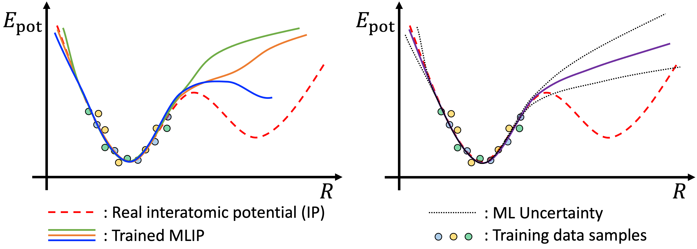
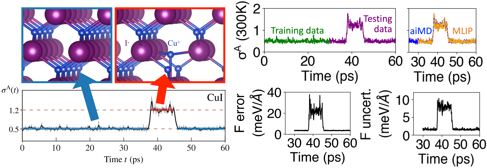
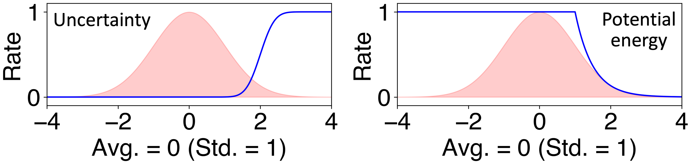
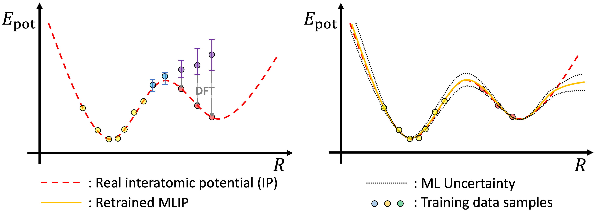

# Theoretical Background

Active-learning machine-operated molecular dynamics (ALmoMD) is a Python code package designed for the effective training of machine learned interatomic potential (MLIP) through active learning based on uncertainty evaluation. It also facilitates the implementation of molecular dynamics (MD) using trained MLIPs with uncertainty evaluation.

## Uncertainty Evaluation

 
<figure style="text-align:center;">
  
  <figcaption>Figure 1. (Left) Various models can be trained using the Subsampling and Deep Ensemble methods. (Right) The disparity in their predictions can be quantified by calculating their standard deviation, which serves as a measure of uncertainty.</figcaption>
</figure>
 

In ALmoMD, __uncertainty__ refers to the prediction uncertainty of a group of trained models, which can be obtained through three distinct training methods [1]. First, each model can be trained with the same number of different training data (Subsampling). Second, each model can be trained with different random initializations of the machine learning model but the same training data (Deep Ensemble). Lastly, each model can be trained using different machine learning techniques. In each case, as displayed in Fig. 1, these models provide a range of different predictions, and their standard deviation indicates the degree of uncertainty, which is used in active learning. ALmoMD combines Subsampling and Deep Ensemble methods to determine this uncertainty.

 
<figure style="text-align:center;">
  
  <figcaption>Figure 2. (Left) The anharmonicity trajectory of CuI from _ab initio_ MD. Defect creation happens around 38 ps, which yields a jump of anharmonicity. This figure is utilized with acknowledgment from [3]. (Right) When MLIP is only trained with data less than 30 ps (green trajectory), MLIP cannot be trained with states with a defect in purple trajectory, which makes large spikes in errors and uncertainties of forces.</figcaption>
</figure>
 

We note that there are significant concerns regarding the use of uncertainty in global phase predictions, as raised by both the Zipoli group [1] and Scheffler group [2]. However, in ALmoMD, we utilize uncertainty to qualitatively identify cases when the models go beyond their trained domain, enabling us to determine where additional model training is necessary. For instance, consider CuI [3], which exhibits a rare dynamical event involving defect creation, as illustrated in Fig. 2. Due to the challenging nature of _ab initio_ MD, there's a possibility of terminating it before experiencing this event, for example, at 30 ps. In such cases, we train the MLIP using only the green trajectory of anharmonicity [4] shown in Fig. 2. When we subsequently test these trained models with the purple trajectory, which includes states with defects, it results in significant spikes in errors and uncertainties (as seen in the forces in Fig. 2). Therefore, we can qualitatively employ uncertainty as a means of identifying when MD departs from its trained regime.

## Active Learning Scheme

 
<figure style="text-align:center;">
  
  <figcaption>Figure 3. (Left) New data (light blue and purple points) are obtained from molecular dynamics using MLIP. The error bars indicate their uncertainty. Since the purple points exhibit high uncertainty, they are selected for the next round of training data, and their energies are subsequently corrected through DFT calculations. (Right) Retraining with additional samples from the active learning process will yield a more reliable MLIP, which can be iteratively improved.</figcaption>
</figure>
 

ALmoMD facilitates this qualitative identification of uncertainty to sample next round of training data. Uncertainty can be evaluated in terms of potential energy, forces on atoms, and degree of anharmonicity. Particularly for forces, uncertainty can be picked as its average or its maximum value. On the other hand, ALmoMD rejects candidate data when it has too large potential energy, which is unphysical. This can happen because MD with MLIP might be a flawed trajectory. In details, ALmoMD uses two soft criteria regarding uncertainty and potential energy.

 
<figure style="text-align:center;">
  
  <figcaption>Figure 4. (Left) New data (light blue and purple points) are obtained from molecular dynamics using MLIP. The error bars indicate their uncertainty. Since the purple points exhibit high uncertainty, they are selected for the next round of training data, and their energies are subsequently corrected through DFT calculations. (Right) Retraining with additional samples from the active learning process will yield a more reliable MLIP, which can be iteratively improved.</figcaption>
</figure>
 

# References
[1] L. Kahle and F. Zipoli, _Phys. Rev. E_ __105__, 015311 (2022).
[2] S. Lu, L.M. Ghringhelli, C. Carbogno, J. Wang, and M. Scheffler, arXiv:2309.00195 (2023).
[3] F. Knoop, T. A. R. Purcell, M. Scheffler, and C. Carbogno, _Phys. Rev. Lett._ __130__, 236301 (2023)
[4] F. Knoop. T. A. R. Purcell, M. Scheffler, and C. Carbogno, _Phys. Rev. Materials_ __4__, 083809 (2020)

# Contents
- [Back to Home](https://keysongkang.github.io/ALmoMD/)
- [Installation Guide](installation.md)
- [User Manuals](documentation.md)
- [Tutorials](tutorial.md)